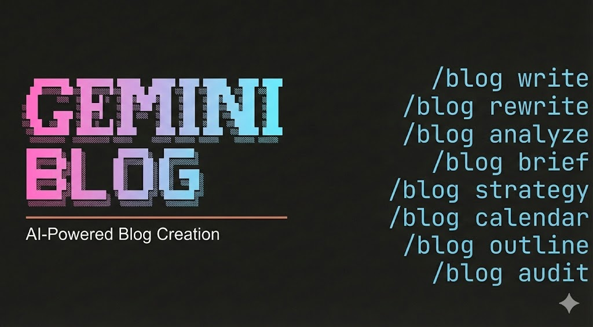

# gemini-blog




**The most comprehensive blog creation skill for Gemini CLI.**

Strategy, briefs, calendars, writing, optimization, schema, repurposing, and full-site audits — all from slash commands. Dual-optimized for Google rankings and AI citation platforms (ChatGPT, Perplexity, AI Overviews).

### [Watch the Demo](https://www.youtube.com/watch?v=AeLC4iutG8w)


---

## Quick Start

```bash
git clone https://github.com/imitry/gemini-blog.git
cd gemini-blog
gemini extensions install .
```

Verify installation:
```bash
gemini extensions list
```

## Commands

| Command | Description |
|---------|-------------|
| `/blog:write <topic>` | Write a new blog post from scratch |
| `/blog:rewrite <file>` | Optimize an existing blog post |
| `/blog:analyze <file>` | Quality audit with 0-100 score |
| `/blog:brief <topic>` | Generate a detailed content brief |
| `/blog:calendar` | Generate an editorial calendar |
| `/blog:strategy <niche>` | Blog strategy and topic ideation |
| `/blog:outline <topic>` | SERP-informed content outline |
| `/blog:seo-check <file>` | Post-writing SEO validation |
| `/blog:schema <file>` | Generate JSON-LD schema markup |
| `/blog:repurpose <file>` | Repurpose for social, email, YouTube |
| `/blog:geo <file>` | AI citation readiness audit |
| `/blog:audit [directory]` | Full-site blog health assessment |

## Features

### 12 Content Templates
Auto-selected based on topic and intent: how-to guide, listicle, case study, comparison, pillar page, product review, thought leadership, roundup, tutorial, news analysis, data research, FAQ knowledge base.

### 5-Category Quality Scoring (100 Points)
| Category | Points | Focus |
|----------|--------|-------|
| Content Quality | 30 | Depth, readability, originality, engagement |
| SEO Optimization | 25 | Headings, title, keywords, links, meta |
| E-E-A-T Signals | 15 | Author, citations, trust, experience |
| Technical Elements | 15 | Schema, images, speed, mobile, OG tags |
| AI Citation Readiness | 15 | Citability, Q&A format, entity clarity |

Scoring bands: Exceptional (90-100), Strong (80-89), Acceptable (70-79), Below Standard (60-69), Rewrite (<60).

### AI Content Detection
Burstiness scoring, known AI phrase detection (17 phrases), vocabulary diversity analysis (TTR). Flags content that reads as AI-generated.

### Dual Optimization
Every article targets both Google rankings and AI citation platforms:
- **Google**: December 2025 Core Update compliance, E-E-A-T, schema markup, internal linking
- **AI Citations**: Answer-first formatting (+340% citations), citation capsules, passage-level citability, FAQ schema (+28% citations)

### Visual Media
- Pixabay/Unsplash/Pexels image sourcing with alt text
- Built-in SVG chart generation (bar, grouped bar, lollipop, donut, line, area, radar)
- Image density targets by content type
- Image URL verification (HTTP 200 check before embedding)

### Platform Support
Next.js/MDX, Astro, Hugo, Jekyll, WordPress, Ghost, 11ty, Gatsby, and static HTML.

## Architecture

```
gemini-blog/
+-- gemini-extension.json            # Extension manifest
+-- GEMINI.md                        # Main orchestrator (12 commands)
+-- blog/
|   +-- references/                  # 12 on-demand reference docs
|   |   +-- google-landscape-2026.md
|   |   +-- geo-optimization.md
|   |   +-- content-rules.md
|   |   +-- visual-media.md
|   |   +-- quality-scoring.md
|   |   +-- platform-guides.md
|   |   +-- distribution-playbook.md
|   |   +-- content-templates.md
|   |   +-- eeat-signals.md
|   |   +-- ai-crawler-guide.md
|   |   +-- schema-stack.md
|   |   \-- internal-linking.md
|   +-- templates/                   # 12 content type templates
|   |   +-- how-to-guide.md
|   |   +-- listicle.md
|   |   +-- case-study.md
|   |   +-- comparison.md
|   |   +-- pillar-page.md
|   |   +-- product-review.md
|   |   +-- thought-leadership.md
|   |   +-- roundup.md
|   |   +-- tutorial.md
|   |   +-- news-analysis.md
|   |   +-- data-research.md
|   |   \-- faq-knowledge.md
|   \-- scripts/
|       \-- analyze_blog.py          # Python quality analysis
+-- skills/                          # 13 sub-skills
|   +-- blog-write/GEMINI.md
|   +-- blog-rewrite/GEMINI.md
|   +-- blog-analyze/GEMINI.md
|   +-- blog-brief/GEMINI.md
|   +-- blog-calendar/GEMINI.md
|   +-- blog-strategy/GEMINI.md
|   +-- blog-outline/GEMINI.md
|   +-- blog-seo-check/GEMINI.md
|   +-- blog-schema/GEMINI.md
|   +-- blog-repurpose/GEMINI.md
|   +-- blog-geo/GEMINI.md
|   +-- blog-audit/GEMINI.md
|   \-- blog-chart/GEMINI.md         # Internal: SVG chart generation
+-- agents/                          # 4 specialized agents
|   +-- blog-researcher.GEMINI.md
|   +-- blog-writer.GEMINI.md
|   +-- blog-seo.GEMINI.md
|   \-- blog-reviewer.GEMINI.md
+-- commands/blog/                   # 12 Gemini CLI slash commands
|   +-- write.toml
|   +-- analyze.toml
|   \-- ... (10 more)
+-- docs/                            # Documentation
|   +-- INSTALLATION.md
|   +-- WORKFLOW-TUTORIAL.md
|   +-- COMMANDS.md
|   +-- ARCHITECTURE.md
|   +-- TEMPLATES.md
|   +-- TROUBLESHOOTING.md
|   \-- MCP-INTEGRATION.md
+-- assets/                          # Images and demo GIFs
+-- requirements.txt                 # Python dependencies
+-- CHANGELOG.md
+-- LICENSE
\-- README.md
```

## Requirements

- [Gemini CLI](https://geminicli.com/docs/) CLI installed and configured
- Python 3.12+ (for `analyze_blog.py` quality scoring script)
- Optional: `pip install -r requirements.txt` for advanced analysis (readability scoring, schema detection)

## Uninstall

```bash
gemini extensions uninstall gemini-blog
```

## Integration

Chart generation is built-in — no external dependencies required for full functionality.

**Optional companion skills** (for deeper analysis of published pages):

| Skill | Integration |
|-------|-------------|
| `/seo` | Deep SEO analysis of published blog pages |
| `/seo-schema` | Schema markup validation and generation |
| `/seo-geo` | AI citation optimization audit |

## GitHub Artifacts

This repository utilizes standard GitHub features to manage project lifecycle and delivery:

- **Releases**: Official stable versions of the `gemini-blog` extension. Use releases to download specific versioned snapshots instead of the latest (potentially unstable) code from the `main` branch.
- **Deployments**: Tracks the status of the engine's integration environments and automated validation runs.
- **Packages**: Hosts ready-to-use distribution assets for seamless integration into other AI workflows.

## Documentation

Detailed documentation is available in [docs/](docs/):

- [Installation Guide](docs/INSTALLATION.md) -- Get started with the native extension installer
- [Workflow Tutorial](docs/WORKFLOW-TUTORIAL.md) -- Step-by-step guide to the blog creation lifecycle
- [Command Reference](docs/COMMANDS.md) -- Full 12-command reference with examples
- [Architecture](docs/ARCHITECTURE.md) -- System design and component overview
- [Templates](docs/TEMPLATES.md) -- Template reference and customization
- [Troubleshooting](docs/TROUBLESHOOTING.md) -- Common issues and fixes
- [MCP Integration](docs/MCP-INTEGRATION.md) -- Optional MCP server setup

## Contributing

Contributions welcome! Please:
1. Fork the repository
2. Create a feature branch
3. Submit a pull request

## License

MIT License. See [LICENSE](LICENSE) for details.

---

Built by [imitry](https://github.com/imitry) with Gemini CLI.

Original author: [AgriciDaniel](https://github.com/AgriciDaniel). English version for Claude Code.

